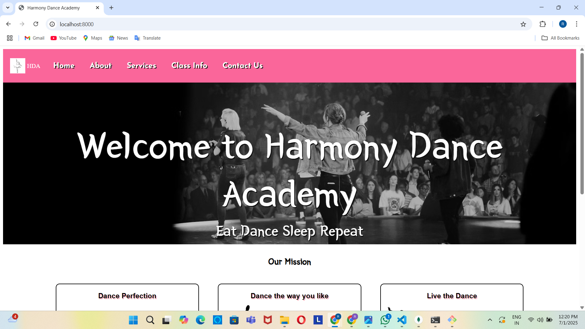
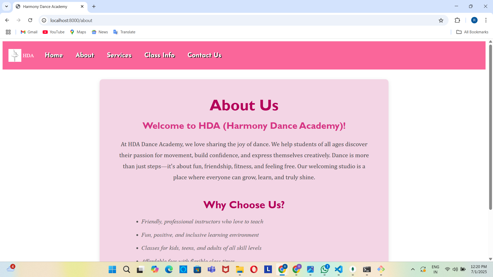
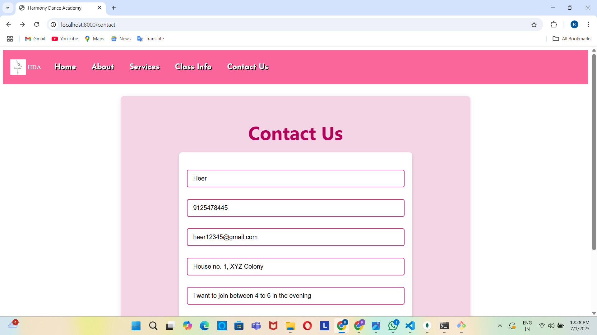
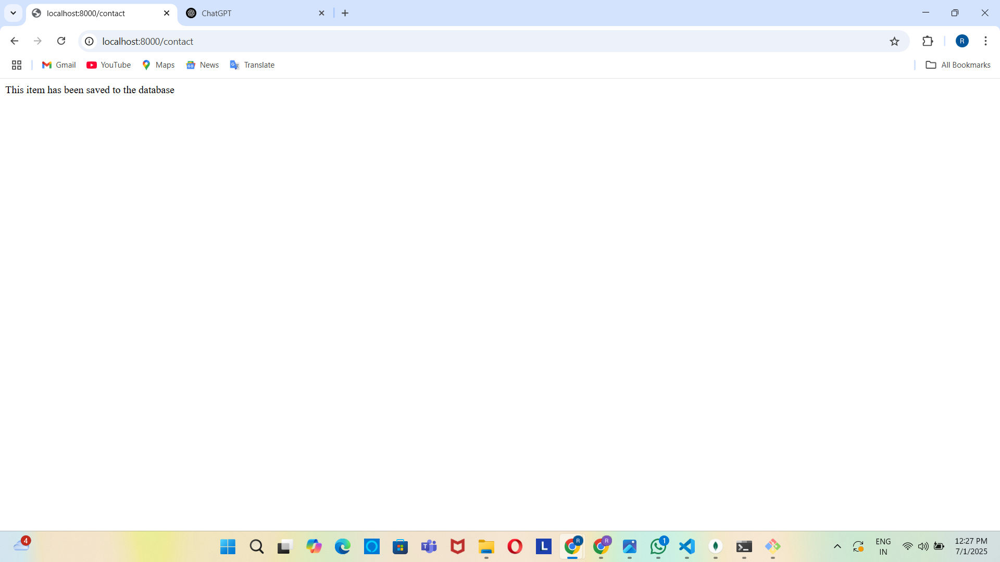
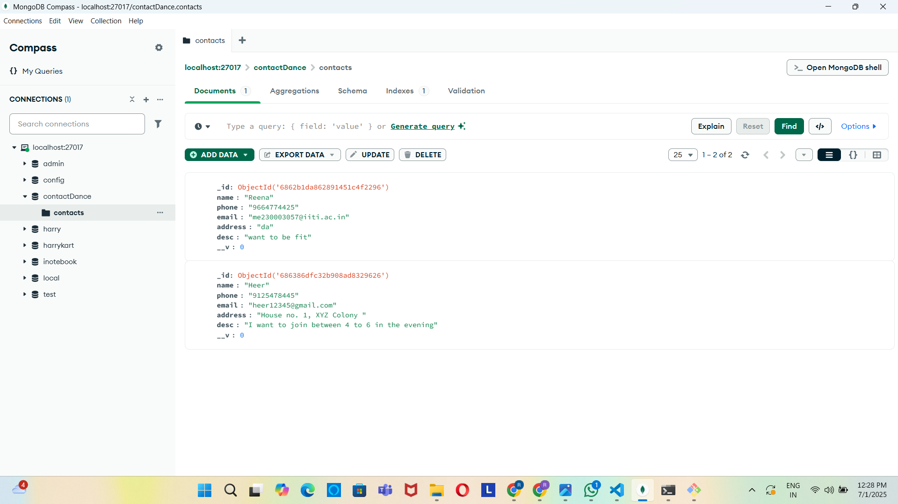

## 💃🏻 Harmony Dance Academy Website
Welcome to the official website project for **Harmony Dance Academy** – a platform designed to showcase our dance classes, services, and let new students reach out to us with ease.

This project uses **Node.js**, **Express**, **Pug**, and **MongoDB** to build a complete, dynamic website with form submissions saved to a database.

---
## 🎯 Features
- Beautiful landing page with navigation bar
- About Us section describing the academy's mission
- Services page listing available offerings
- Class Information page with levels and age groups
- Contact Us form that saves submissions to MongoDB
- Fully responsive layout using Pug templates and CSS

---
## 🛠️ Technologies Used
- **Backend**: Node.js, Express.js
- **Database**: MongoDB (Mongoose)
- **Templating**: Pug
- **Styling**: CSS

---
## 📦 Folder Structure
```
project/
│
├── static/             # Static assets (CSS, images, JS)
│
├── views/              # Pug templates
│   ├── base.pug
│   ├── home.pug
│   ├── about.pug
│   ├── services.pug
│   ├── classinfo.pug
│   └── contact.pug
│
└── app.js              # Express server
```
---
## 💻 How to Run Locally
1. **Clone the repository**
 ```bash
   git clone https://github.com/yourusername/reena-dance-academy.git
   cd reena-dance-academy
```
2. **Install dependencies**
 ```bash
npm install
```
3. **Make sure MongoDB is running**
   ```bash
   mongodb://localhost:27017/contactDance
5. **Start the server**
 ```bash
node app.js
```
4. **Open in browser**
 ```bash
(http://localhost:8000)
```
---
## 🗄️ Database
MongoDB Database: `contactDance`
Collection: `contacts`

Fields stored:
- Name
- Phone
- Email
- Address
- Description

✅ Submissions from the Contact Us form are saved to this collection.

---
## 📸 Screenshots
**Home Page**




**About Us Page**



**Contact Us Page**



**Data saved successfully**



**MongoDB folder**



---
## 🙋‍♀️ About Me
Reena Meena
Student at IIT Indore | Passionate about coding and web development
🌟 This project combines my love for wb development, clean UI design, and programming.

---
## 📄 License
This project is open-source and available under the MIT License.

---
